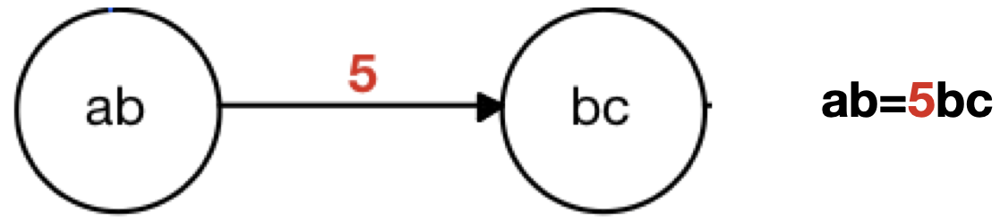
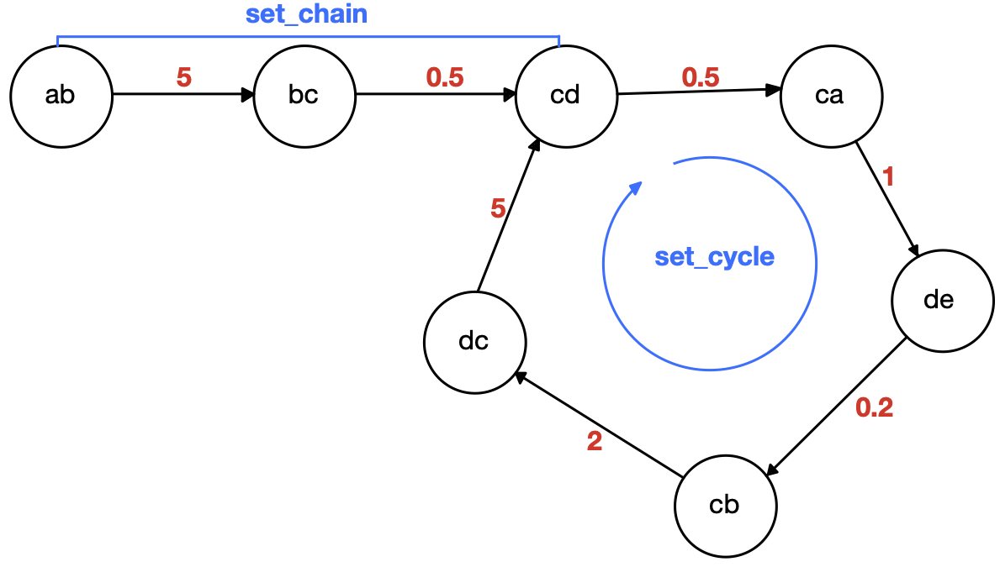
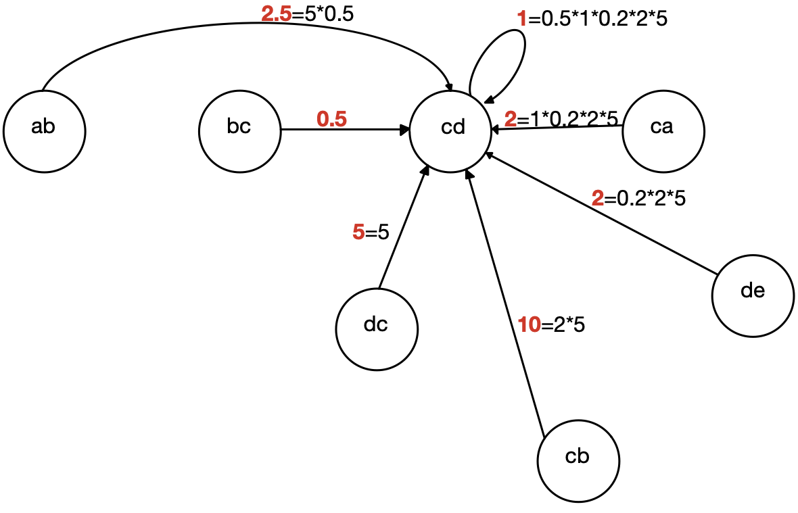

## Idea:
We have a set of `N` variables `α=[α_1,α_2,...,α_N]` minus the identity.<br/>
We define the set of substitutions of degree m with the tensor `Tm[i_1,i_2,...,i_m]` such that
`α_{i_1}*α_{i_2}*...α_{i_m}=Tm[i_1,i_2,...,i_m]`.<br/>
The number of elements of the tensor is `N^m`.<br/>
The general substitution will work by iterating over all indices of the tensor for all the specified degrees m  the `sub_monomial()` function

`sub_monomial(mon1,α_{i_1}*α_{i_2}*...α_{i_m},Tm_{i_1,i_2,...,i_m},recursive=true);`.

It has to be iterated until no possible substitutions are found.

Deciding when to stop is **critical**, we can easily fall in cyclical substitutions.

  ***example 1***  
  We define

  + `α   = [x,y,z]`  
  + `T1 = [y,x,z]`  
  + `mon1= x`  

  then we have the following chain  

  + _first iteration_ `x→y→x`  
  + _second iteration_ `x→y→x`  
  + ...  

  This is because there was a _closed path of substitutions_. **This must be avoided**.
  How can we avoid it? There is any theory for it?

💡If the degree of each element of `Tm[i_1,i_2,…,i_m]` is strictly smaller than `m` then we do not have closed  path of substitutions. This can be a first rudimentary check, but we are not considering all the possible substitutions, see next example.

  ***example 2***  
  We define

  + `α   = [x,y,z]`
  + `T1 = [y,y,z]`
  + `mon1= x`

  then we have the following chain

  + _first iteration_ `x→y`

  Here there are no closed path of substitutions in `T1`.

💡 We will write an algorithm for checking if there is any closed path and in case resolve it.


## Substitution tensor
The program should work with these steps:

  1. Accept a tensor of substitutions `T`.
  2. Optimise the substitutions' tensor.
  3. Apply recursively the substitutions.

The optimisation step should return a `T` such that a recursive substitutions routine eventually stops.
### Form of the substitution  tensor
Defined an array of variables `α=[α_1,α_2,...,α_N]` the elements of the substitutions tensor `Tm` must be `Union{T, PolyVar{C}, Monomial{C}, Term{C, T}}` we call this _variables form_.<br/>
Once decided how to deal with `Polynomial{C,T}` we should extend the substitutions to the whole `MPolynomialLike`.
It must be even possible to specify each element of `Tm` as a `Tuple{Int}` of at most `(m+1)-element`.<br/>
Each array will specify how to build the monomial to substitute.<br/>
  ***example***

  + `T2[1,2]=(1,3,4)` indicate the substitution `α_1α_2`→`α_3α_4`.
  + `T2[1,2]=(1,4)` indicate the substitution `α_1α_2`→`α_4`.
  + `T2[1,2]=(7,4)` indicate the substitution `α_1α_2`→`7*α_4`.
  + `T2[1,2]=(2,0)` indicate the substitution `α_1α_2`→`2`.

When a susbstitution tensor is written in this form we will say it is in _tuples form_.

We must be able to specify the maximum degree `m` of the substitutions when calling the recursive substitution algorithm. In this case we have to specify a tuple of `m` different substitution tensors. In the case `Tm` is specified and `T^(m-1)` is not specified, `T^(m-1)` will be assumed to be `T^(m-1)[i_1,...,i_{m-1}]=(1,i_1,...,i_{m-1})`.


### Optimisation of the substitution tensor
The optimisation steps consist in expressing the substitutions tensors in _standard form_ and then optimising it in order to avoid closed substitution cycles.<br/>
#### Standard form of the substitution tensor
The standard form of the substitution tensor has the same structure for every value of `m`. Each element of `Tm` is a `3-element` tuple with:
+ first element equal to the first element of the tuple of the tuple form,
+ second element equal the degree of the substitution,
+ third element equal to the linear index associated to the cartesian index encoded in the other elements of the tuple in the tuple form.

  ***example***

  Consider the `3x3` substitution tensor `T2` associated to the variables vector `α=[α_1,α_2,α_3]`.<br/>
  The following are the representation of the same element in different forms:

  + _variables form_ → `T2[1,2]=7*α_2α_3`,
  + _tuple form_ → `T2[1,2]=(7,2,3)`,
  + _standard form_ → `T2[1,2]=(7,2,8)`;

or

+ _variables form_ → `T2[1,2]=5*α_2`,
+ _tuple form_ → `T2[1,2]=(5,2)`,
+ _standard form_ → `T2[1,2]=(5,1,2)`.


or

+ _variables form_ → `T2[1,2]=5*α_2^2`,
+ _tuple form_ → `T2[1,2]=(5,2,2)`,
+ _standard form_ → `T2[1,2]=(5,2,5)`.


or

+ _variables form_ → `T2[1,2]=5*α_2^2*α_3`,
+ _tuple form_ → `T2[1,2]=(5,2,2,3)`,
+ _standard form_ → _not admitted, the degree of the substitution is bigger then m_.


#### Checking and solving closed cycles
For avoiding closed cycles we use the following algorithm on the standard form of `Tm` for every `m`.
1. Set `index=1` and the reset setting to `cindex=[]`, `coeffs=[]`, `chain=0`.
2. If `index=N^m` then finish.
3. `push!(cindex,index)`, `push!(coeffs,1)` and `chain++`
4.
  + If `Tm[cindex[chain]][2]>m` then refuse the substitution tensor.
  + If `Tm[cindex[chain]][2]<m` then then `index++` and `set_chain(Tm,cindex,coeffs)` and `reset()` and go to point 2.
  + If `Tm[cindex[chain]][2]=m` then `push!(cindex,Tm[cindex[end]][3])`, `push!(coeffs,Tm[cindex[end]][1])` and `chain++`.

5. Define `first=findfirst(x->x==cindex[chain],cindex)`then
  + If `first!=chain` <!--and `chain=2`-->, then `index++` and `set_cycle(Tm,cindex[first:chain],coeffs[first:chain])` then, _after set_cycle_ `set_chain(Tm,cindex[1:(first)],coeffs[1:first]` and `reset()` and then go to point 2.
  + If `first==chain` go to point 4.

```julia
function set_chain(Tm,cindex,coeff)
    for i=1:(end-1)
      Tm[cindex[i]][2:3] = Tm[cindex[end]][2:3];
      Tm[cindex[i]][1]  = prod(coeff[(i+1):end]);
    end
  end
```

```julia
function set_cycle(Tm,cindex,coeff)
    @assert prod(coeff)==1
    set_chain(Tm,cindex,coeff)
  end
```

❓Is it possible to be blocked in the loop of point 4 and 5 forever?

***It is important to check for all the Tm starting from the bigger `m` and moving to the smaller `m`***

 <br/>
Figure1. This is the notation used.

 <br/>
Figure2. Representation of a possible set of substitutions.

 <br/>
Figure3. Substitutions after having solved cycles and chains.


<!-- 5. Define `first=findfirst(x->x==Tm[index][3]=m,cindex)`then
  + If `first==index` and `cycle=1` then `index++`, and reset `cindex`,`coeffs` and `cycle`.
  + If `first==index` and `cycle!=1` then `push!(cindex,Tm[index][3])` and go to ...
  + Else  
    + If `prod(cindex[first,])` -->


🈺 This algorithm works for substitutions of `MMonomialLike`→`MMonomialLike`.<br/>
&nbsp;&nbsp;&nbsp;&nbsp;&nbsp;&nbsp;In the case one has to deal with substitutions of `MMonomialLike`→`Polynomial` there are different possibilities.<br/>
&nbsp;&nbsp;&nbsp;&nbsp;&nbsp;&nbsp;Suppose we are dealing with substitutions tensor of order `m`. Let us consider `Tm[i_1,...,i_m]=P`, where `P` is a `Polynomial`.  

&nbsp;&nbsp;&nbsp;&nbsp;&nbsp;&nbsp;✅All the monomial in `P` of order smaller then `m` are accepted.<br/>
&nbsp;&nbsp;&nbsp;&nbsp;&nbsp;&nbsp;❌All the monomial in `P` of order bigger then `m` are not accepted and we will not accept `T`.<br/>
&nbsp;&nbsp;&nbsp;&nbsp;&nbsp;&nbsp;✅If in `P` there is a single monomial of order `m` than one runs the algorithm for `MMonomialLike`→`MMonomialLike`following single monomials of order `m`.<br/>
&nbsp;&nbsp;&nbsp;&nbsp;&nbsp;&nbsp;❌If in `P` thare are more then one monomial of order `m` we will not accept the `T`.

&nbsp;&nbsp;&nbsp;&nbsp;&nbsp;&nbsp;Possibly multiple monomial of degree `m` and monomial of degree higher then `m` are acceptable. We should ask Marc-Olivier.


## First physical example:
We consider the vector of Pauli operators `α={X,Y,Z}`.<br/>
We indicate with `[A,B]` and `{A,B}` respectively the commutator and anticommutator of `A` and `B`.<br/>
The commutation and anticommutation rules of this set are known.<br/>
Given `[α_1,α_2]` and `{α_1,α_2}` we know that `α_1*α_2=([α_1,α_2]+{α_1,α_2})/2`.  <br/>
The set of substitutions of degree `1` is
```
T1=[_,_,_]
```
We can then build the set of substitutions of degree `2`:
```
        1   +iZ   -iY
T2 = -iZ     1    iX
       iY   -iX     1
```
The degree of the elements of `T` is at most `1` thus there are no cyclic paths.
We can use it.

<!-- 🚩Pay attention to the concept of _ordering_ for Pauli operators, as for example
  a normal ordered string of Pauli matrices would be `XYZ` but this string is
  equal to `I`.  -->


## Second physical example:
We consider the vector of Pauli operators `α=[X_1,Y_1,Z_1,X_2,Y_2,Z_2]`.<br/>
The set of substitutions of degree `2` is the direct sum of the set of substitutions
of order `2` for `α_1=[X_1,Y_1,Z_1]` `T2_1` and the set of substitutions of order `2`
for  `α_2=[X_2,Y_2,Z_2]` `T2_2`.<br/> This _sparsity_ should be exploited for bigger systems.
